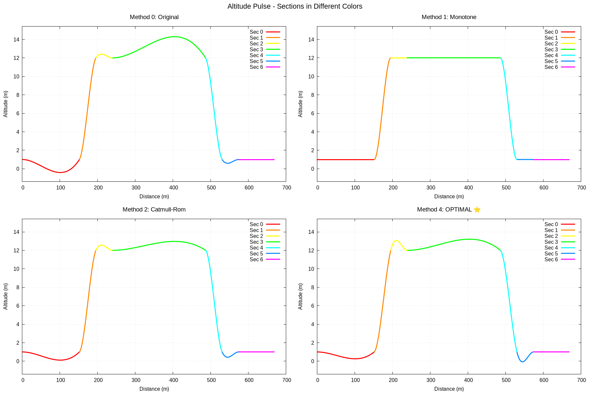
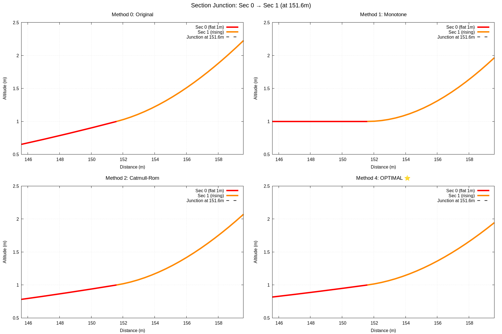

# 4psi - 4 Point Spline Interpolation

GPL Track Altitude Equation Generator

Create GPL track editing altitude trace equation coefficients. Each equation is defined by 4 point sets that make up the previous, current and next sections start and end points.

## Usage

**4psi** provides 5 smoothing methods for altitude profile generation:

```bash
# Method 0: Four Point (smooth, may overshoot)
./4psi -m 0 -q 4.0 alt_mytrack.txt

# Method 1: Monotone (Fritsch-Carlson, no overshoot, C¹ continuity)
./4psi -m 1 alt_mytrack.txt

# Method 2: Catmull-Rom with tension (adjustable smoothness)
./4psi -m 2 -t 0.3 alt_mytrack.txt

# Method 3: Limited slopes (fast, minimal overshoot)
./4psi -m 3 alt_mytrack.txt

# Method 4: Harmonic Mean (RECOMMENDED - maximum smoothness, optimized overshoot, C¹ continuity)
./4psi -m 4 alt_mytrack.txt

# Generate all comparison plots
./generate_all_plots.pl alt_mytrack.txt
```

## Algorithm Comparison

| Method | Algorithm | Smoothness | Overshoot | Continuity | Use Case |
|--------|-----------|-----------|-----------|------------|----------|
| **0** | Four Point | ⭐⭐⭐⭐⭐ | ⚠️ Adjustable | C¹ | Smooth terrain |
| **1** | Monotone | ⭐⭐⭐ | ✅ None | C¹ | Accuracy critical |
| **2** | Catmull-Rom | ⭐⭐⭐⭐ | ⚠️ Adjustable | C¹ | Fine control |
| **3** | Limited Slopes | ⭐⭐⭐ | ✅ Minimal | C¹ | Quick processing |
| **4** | Harmonic Mean | ⭐⭐⭐⭐⭐ | ✅ Controlled | C¹ | **Recommended** ⭐ |

📖 **See [HARMONIC_MEAN_ALGORITHM.md](HARMONIC_MEAN_ALGORITHM.md) for technical details**  
📖 **See [SOLUTION_SUMMARY.md](SOLUTION_SUMMARY.md) for complete documentation**  
📖 **See [QUICK_TEST.md](QUICK_TEST.md) for testing guide**

## Visual Examples

### Method Comparison - Pulse Test



This visualization shows how different smoothing methods handle a challenging "pulse" test case with sharp transitions. The Harmonic Mean method (green) provides smooth curves while avoiding overshoot, compared to other methods.

### Junction Detail - Continuity



Close-up view of section junctions showing how the Harmonic Mean method maintains smooth C¹ continuity (continuous position and slope) at transition points between sections.

---

## Quick Start - New Track

To process a new track altitude file:

```bash
# 1. Run 4psi on your altitude file (uses Harmonic Mean method by default)
./4psi alt_newtrack.txt

# 2. Visualize the results
gnuplot __do_plot_all.txt

# 3. The output file for GPL track editor is ready
# Import: __gtk_csv.TXT
```

### Generate Comparison Plots

```bash
# Generate all visualization plots for your track
./generate_all_plots.pl alt_newtrack.txt

# View the generated plots:
#   - __do_plot_method0.txt through __do_plot_optimal.txt (plot scripts)
#   - __gtk_csv_method0.TXT through __gtk_csv_optimal.TXT (coefficients)
```

### Using Make for Complete Workflow

```bash
# Run complete analysis (all methods + visualizations)
make alt_newtrack.alt

# This automatically:
#   - Runs all 5 smoothing methods
#   - Generates comparison data
#   - Creates visualization plots (if using alt_mytrack.txt)
```

---

## Input Format

Import altitude data one column for each trace.

Format:

`   Section Name, Section Length, Trace 1 Altitude, Trace 2 Altitude, ...`

Where `Trace Altitude` is the elevation (Y value) at the start of the section for each trace.

The 4psi program also creates stitched gnuplot derived formulas for each trace and section of the track for visualizing equation curves. 


Equations for solving functions. 

$f(x) = Ax^3 + Bx^2 + Cx + D$ ; Equation for altitude or Y at any X location

$f'(x) = 3Ax^2 + 2Bx + C$;  Equation derivitave for slope of altitudes

$f(0) = Y_0 = D$;  Altitude at the start of a section

$f(L) = Y_L = AL^3 + BL^2 + CL$;  Altitude at the end of a section

$f'(0) = S_0 = C$;  Slope at the start of a section

$f'(L) = S_L = 3AL^2 + 2BL + S_0$;   Slope at the end of a section


Subtract $2f(L) - Lf'(L)$ to get $A$

$A = 1/L^3 [L(S_0 + S_L) + 2(Y_0 - Y_L)]$

Solve for $B$ in $f'(x)$

$B = 1/L^2 [(-2S_0 - S_L) - 3(Y_0 - Y_L)]$


Convert range from [0:L] to [0:1]

$A_{[0:1]} = L^3 A_{[0:L]}$

$B_{[0:1]} = L^2 B_{[0:L]}$

$C_{[0:1]} = L C_{[0:L]}$

$D_{[0:1]} = D_{[0:L]}$


**============================================================================**


### **$A = L(S_0 + S_L) + 2(Y_0 - Y_L)$**

### **$B = (-2S_0 - S_L) - 3(Y_0 - Y_L)$**

### **$C = LS_0$**

### **$D = Y_0$**


